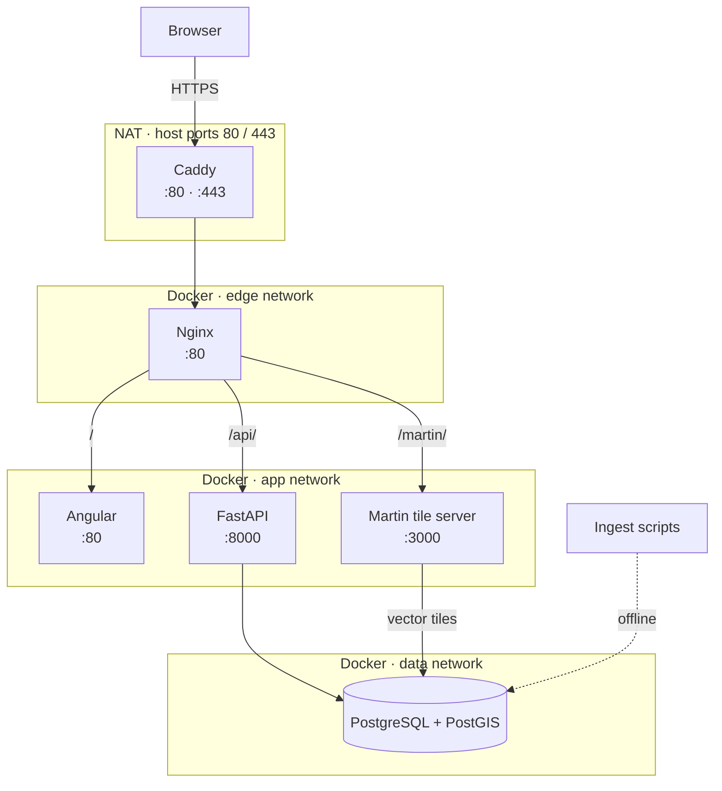
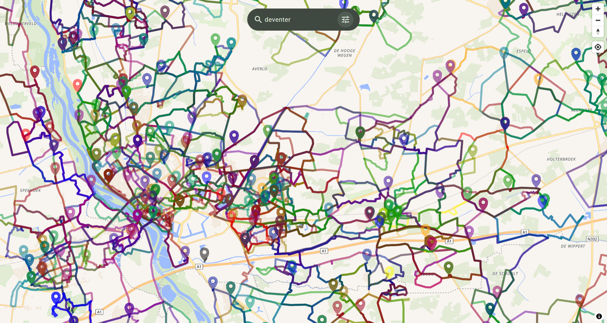
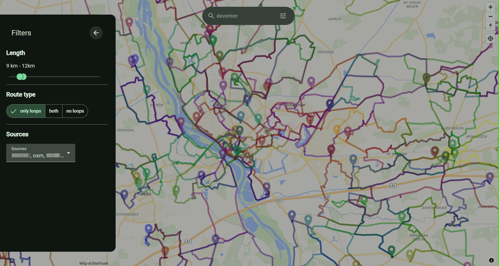
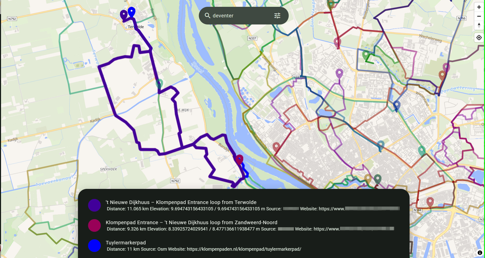
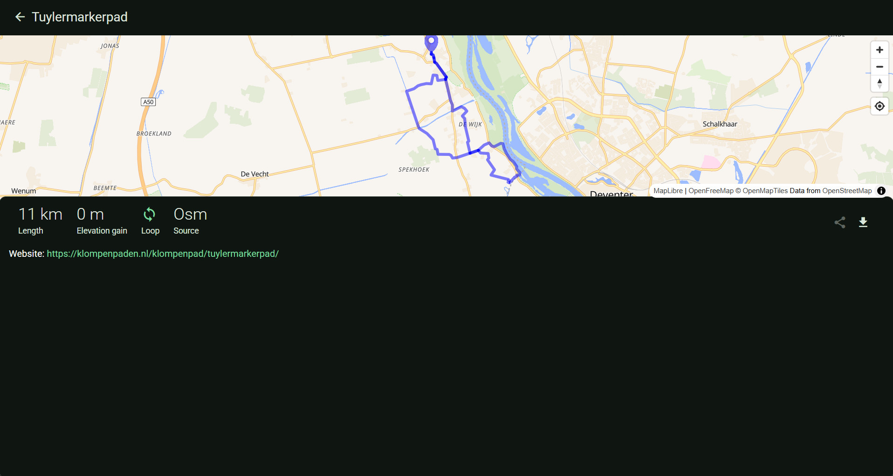
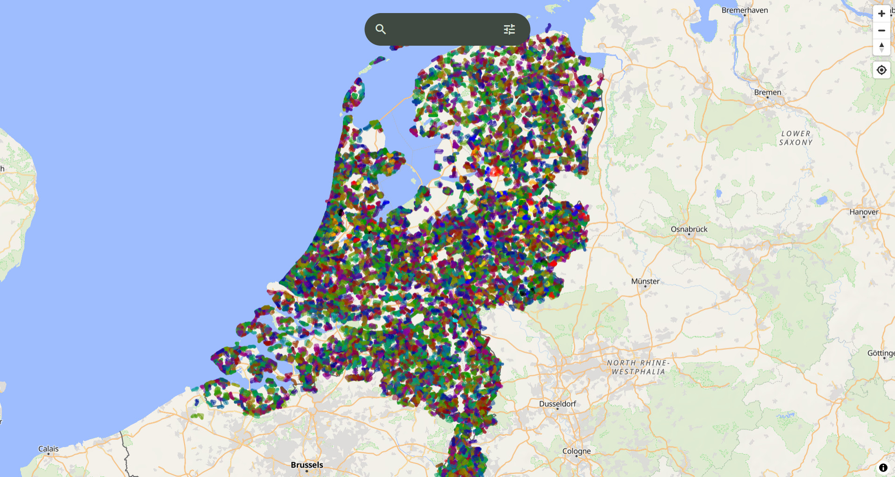

# Explorinator

Explorinator combines hiking routes from multiple large aggregators into a single, searchable map.

## Background

I used to be a big fan of [gpsies.com](https://wiki.openstreetmap.org/wiki/Gpsies.com). Gpsies hosted routes from individual contributors, which meant you could see clusters of routes in a given area and plan trips around them. After Gpsies was acquired by Alltrails, I lost that ability. Alltrails is a better service in many ways, but it does not let you see all available routes at once on a map — and neither does any other major aggregator I know of (Komoot, Wikiloc, Outdooractive, etc.).

## How it works

Inspired by [waymarkedtrails.org](https://www.waymarkedtrails.org/), I built a web application that renders routes directly on a map. Unlike the large aggregators, routes do not need to be loaded individually. Instead, map tiling is used to load both the base map and the routes for a given area simultaneously, making it possible to see all available routes at once. While Waymarked Trails uses static bitmap tiles, this project uses vector tiles, which enables frontend styling and interactivity.

One of the key features of route aggregators is search. With static tiles this is not feasible, but since the introduction of [Martin](https://martin.maplibre.org/) it is possible to pass query parameters and dynamically fetch vector tiles. This project exposes filters for route length, route type (loop vs. point-to-point), and data source. Users can adjust these filters and watch the map update in real time.

## Data

To populate the application, I first wrote an ingestion script for [OpenStreetMap](https://www.openstreetmap.org/), assuming local governments would have uploaded their trails there. Coverage turned out to be uneven — some provinces (in the Netherlands) are well-represented while others contain little useful data *(note to Dutch local governments: please upload your public trails to OSM)*. Because most high-quality route data is locked behind commercial aggregators, I also wrote ingestion scripts for several other sources and was able to collect all their "publicly" accessible data. As this is likely a legal grey area, I am not sharing that code or the data. It is, however, very much possible.

## Features

Routes are styled using [MapLibre](https://maplibre.org/) and rendered in the colors defined by their original source. Because styling happens client-side, colors remain consistent across the app and the map stays interactive. Where routes overlap, clicking any point on the map brings up a list of all routes passing through it. Selecting a route from the list opens a detail view with metadata and a direct GPX download — a feature that is frustratingly locked behind a paywall on most major aggregators.

## Architecture



All services run as Docker containers orchestrated with Compose. Caddy is the public entry point, handling TLS termination — swap `:80` for a domain name in the Caddyfile to get automatic HTTPS. It forwards traffic to the Nginx proxy over the internal `edge` network. Nginx routes requests across the `app` network to the Angular frontend, the FastAPI REST API, or the [Martin](https://martin.maplibre.org/) tile server. API and Martin connect to PostgreSQL + PostGIS over the isolated `data` network. The ingest scripts run offline to populate the database.

## Running

Start the full stack with:

```bash
docker compose up
```

This starts Caddy, Nginx, the Angular frontend, the FastAPI service, the Martin tile server, and PostgreSQL. See the individual READMEs for running each part in isolation or for ingesting data:

- [Frontend](frontend/README.md)
- [API](backend/api/README.MD)
- [OSM ingest](backend/ingest/osm/README.md)
- [Data collector 1](backend/ingest/dc1/README.md)
- [Data collector 2](backend/ingest/dc2/README.md)

## Screenshots

<table>
  <tr>
    <td align="center"><br/><sub>All routes around Deventer</sub></td>
    <td align="center"><br/><sub>Filters for length, route type and data source</sub></td>
  </tr>
  <tr>
    <td align="center"><br/><sub>Clicking the map shows matching routes on that point</sub></td>
    <td align="center"><br/><sub>Detail view of a single route</sub></td>
  </tr>
  <tr>
    <td colspan="2" align="center"><br/><sub>Every hiking route in the Netherlands</sub></td>
  </tr>
</table>

## Reflections

The application has been running well — 140k+ routes collected across the Netherlands, with filtering fast enough to run on a resource-limited NAS. After using it for a while, though, I think I understand why the large aggregators don't offer an "all routes" view: there are simply too many, and showing all of them at once clutters the map and makes it hard to find anything actually worth hiking.

This raises an interesting question about curation. Aggregators likely rank by popularity, which creates a feedback loop where less-discovered routes never surface. I see two ways around this: better filtering, or shifting the model entirely — using routes not as the primary object but as a signal for where good paths exist, and dynamically generating routes from that graph. The latter is almost certainly what Komoot does behind the scenes, judging by their data, and it is the more elegant solution.

Future directions I am considering include clustering logic to reduce visual noise at lower zoom levels and filtering based on terrain type.

